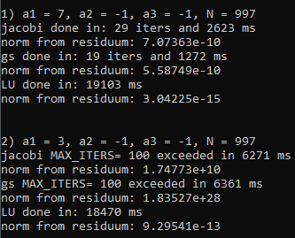

# NumericMethodsProject2-SolvingLinearEquations
The aim of this project was to implement and test methods (Jacobi, Gauss-Seidel and using LU factorization) for solving linear equation systems.

An implementation of Matrix class with basic methods and operators was also needed.

Below are: graph of execution time vs size of the system and results of all three algorithms for two examplary systems.

Results for examplary systems :

